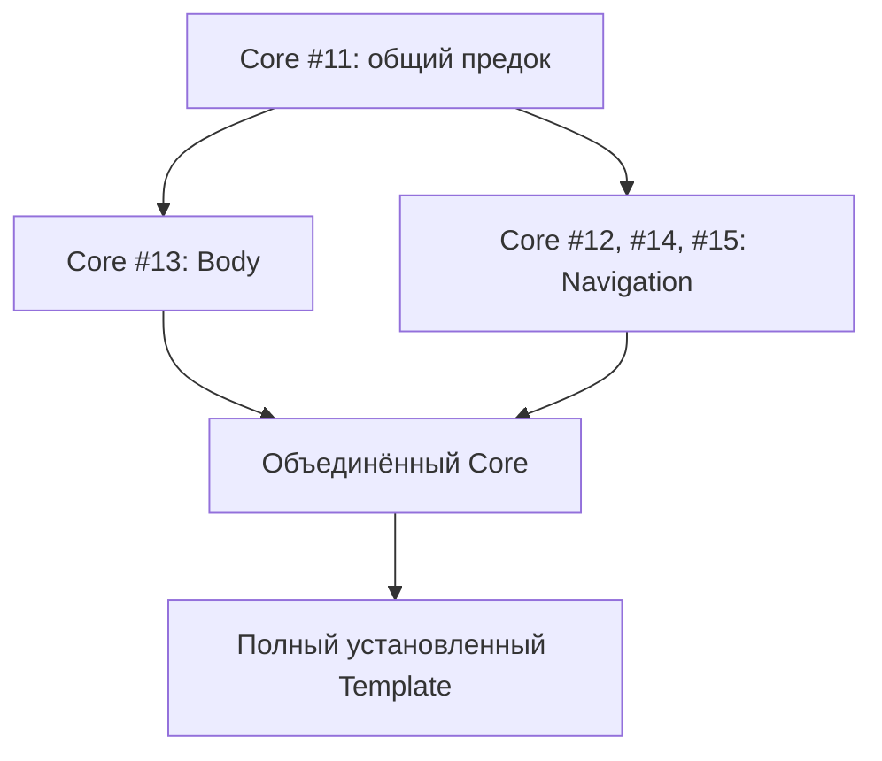

# План завершения текущей поставки Quarto и передачи реализации Codex

> Для исполнителя: выполнять задачи последовательно, отмечая проверяемые результаты. Если в локальном Codex установлен Superpowers, использовать `superpowers:executing-plans`. Этот документ и приложенные требования достаточны для исполнения без истории чата.

**Цель:** завершить начатую поставку Core/QRC/Publisher/Download/Print/Template, доказать совместную установленную сборку исходного курса и подготовить согласованные тематические PR; затем продолжить исходный план без повторной разработки уже проверенных возможностей.

**Архитектура:** учебная семантика и CUE остаются в Core; Presentation и Navigation подключаются отдельно. QRC связывает адреса, Publisher координирует выпуск, Download собирает архивы, Print и LMS получают проверенные пакеты. Шаблон демонстрирует каждую публичную возможность.

**Стек:** Quarto/Pandoc, Lua, TypeScript через штатный `quarto run`, CUE, локальные bundles, R/Jupyter, Typst, Git/GitHub Actions.

**Требования:** `specs/quarto-tools-plan.md` v91, `specs/quarto-managed-portal-implementation-plan.md` v29, `specs/quarto-resource-policy-implementation-plan.md` v6. Они включены в архив передачи. Нормативные требования основного плана находятся в §§1–13; §§14–18 и checkpoints описывают историю выполнения.

**Снимок оценки:** 2026-10-03T09:53:07Z, то есть 3 октября 2026, 12:53 по Минску. Состояние CI меняется; перед исполнением обязательно обновить head и checks.

> **Передача на другой ноутбук, 4 октября 2026:** начинать с `START-NEXT-CODEX.md`. Все локальные native процессы остановлены пользователем (outer143), мониторы558/634/746/750 закрыты. Задачи1–2 приняты; первый открытый gate — Task3 на локальном4c33. Старые статусы/команды ниже — история; текущий checkpoint — §13 Outcomes и `pr-snapshot.json`.

## 1. Оценка ситуации

Работа существенно продвинулась: есть production owner, Header inventory, ресурсная политика, Body export, managed portal, Navigation, bounded native Listing, materialization Print и несколько установленных потребительских проверок. Начинать инструменты заново не требуется.

Однако текущая поставка ещё не завершена. В девяти репозиториях инструментов открыты **23 тематических Draft PR** и два отдельных Dependabot PR. В Java открытых PR нет. У 22 тематических PR проверки на текущих heads завершены успешно, за исключением штатного deploy в Template, который пропущен. Core #15 на текущем head ещё выполняет проверки. Это факт CI, а не доказательство завершения P1/P2 или готовности LMS.

Основные препятствия:

1. **Исходный курс не принят.** Последний сохранённый Original student запуск завершился `RESOURCE.ACTUAL_TARGET_MISSING` на `lectures/01/contracts.html`, до рендера пяти members. Стадия root заняла 3117,425 с, примерно 52 минуты. Проверки members/QRC/finish/seal/PDF не были достигнуты.
2. **Core #15 исправляет этот конкретный пробел**, регистрируя selected nested HTML/PDF/Revealjs outputs для root. Текущий head `0f7f9a84f404c26a04d34d25602a7643ba3a6fd3` новее плана и описания PR. Последний commit меняет только Navigation timeout: prerelease 120 минут, Stable 90. Старое описание говорит о `eab8097...` и лимите 90 минут; его успехи нельзя приписывать новому head.
3. **Body и Navigation живут на расходящихся ветках.** Core #13 и #15 имеют общий предок #11; Git compare: Navigation ahead 16, Body-only 3, status `diverged`. В дереве #15 отсутствует `body-export/`. Сам по себе зелёный #15 не включает Body export.
4. **Будущий Template PR восстановим.** В GitHub существует `feat/native-listing-consumer`, commit `0882865437d5dc752015ffe4695cb776d98c2e85`, tree `f4689e7267359163abfc0573352e9c837869385c`. Его дерево совпадает с записанным reviewed a718. PR для этой ветки пока отсутствует; ожидаемый в прежних записях номер #11 не резервировать.
5. **Проверки Template используют разные поколения providers.** Portal refs пинуют Core #14, Publisher #4, QRC #7, Download #1. Например, `resource-consumer.yml` ещё использует Core #10, экспериментальный producer #8, Publisher #2 и Print #1. Старые проверки полезны как история, но не доказывают общий текущий контракт.
6. **План смешивает спецификацию и огромный журнал.** Основной файл — 433727 байт, 1460 строк. Последние записи не полностью отражают более поздние Git/CI действия. Для Codex нужен небольшой изменяемый план и отдельные неизменяемые исходные требования/доказательства.

Формулировка `Source Approved` в старых документах относится к записанному независимому анализу Source. У проверенных Core #14/#15 и Publisher #4 GitHub review submissions отсутствуют. Все перечисленные PR остаются Draft; merge/release из этих слов не следует.

Это уже интеграционная работа: узкое исправление provider, полный потребительский выпуск и объединение текущих возможностей. Сохранённая ошибка курса имеет конкретную техническую причину; одно увеличение времени жизни облачной сессии её не устранит.

## 2. Фактический реестр PR

Полные SHA, checks, timestamps и ссылки находятся в `pr-snapshot.json`. Таблица фиксирует head, прочитанные при оценке; состояние следует обновить в задаче 1.

| PR | Head | Base | CI снимка |
| --- | --- | --- | --- |
| [quarto-course #15](https://github.com/Afonenko-Course-Tools/quarto-course/pull/15) | `0f7f9a84f4` | `feat/native-listing-owner` | 5 success, 6 running |
| [quarto-course #14](https://github.com/Afonenko-Course-Tools/quarto-course/pull/14) | `e4e151177e` | `feat/native-portal-owner` | 10 success |
| [quarto-course #13](https://github.com/Afonenko-Course-Tools/quarto-course/pull/13) | `9690514a6c` | `feat/complete-owner-inventory` | 7 success |
| [quarto-course #12](https://github.com/Afonenko-Course-Tools/quarto-course/pull/12) | `5eaf483fdd` | `feat/complete-owner-inventory` | 7 success |
| [quarto-course #11](https://github.com/Afonenko-Course-Tools/quarto-course/pull/11) | `946a4eca4f` | `feat/owner-resource-policy` | 5 success |
| [quarto-course #10](https://github.com/Afonenko-Course-Tools/quarto-course/pull/10) | `09f1967f61` | `feat/native-owner-preflight` | 5 success |
| [quarto-course #9](https://github.com/Afonenko-Course-Tools/quarto-course/pull/9) | `21995cac8d` | `feat/p0-contract-probes` | 3 success |
| [quarto-course #8](https://github.com/Afonenko-Course-Tools/quarto-course/pull/8) | `4f5caf9a15` | `master` | 2 success |
| [quarto-course #7](https://github.com/Afonenko-Course-Tools/quarto-course/pull/7) | `2b0ffe5b21` | `master` | 2 success |
| [quarto-course #6](https://github.com/Afonenko-Course-Tools/quarto-course/pull/6) | `d671b33161` | `master` | 3 success |
| [quarto-reference-catalog #7](https://github.com/Afonenko-Course-Tools/quarto-reference-catalog/pull/7) | `9a4bf6aafd` | `master` | 2 success |
| [quarto-template-course #10](https://github.com/Afonenko-Course-Tools/quarto-template-course/pull/10) | `f21105a2ec` | `feat/core-resource-consumer` | 14 success, 1 deploy skipped |
| [quarto-template-course #9](https://github.com/Afonenko-Course-Tools/quarto-template-course/pull/9) | `2ce3a29cca` | `feat/artifact-consumer` | 6 success, 1 deploy skipped |
| [quarto-template-course #8](https://github.com/Afonenko-Course-Tools/quarto-template-course/pull/8) | `a0997b67a6` | `feat/p0-consumer-proof` | 4 success, 1 deploy skipped |
| [quarto-template-course #7](https://github.com/Afonenko-Course-Tools/quarto-template-course/pull/7) | `4a49e2aa30` | `master` | 2 success, 1 deploy skipped |
| [quarto-project-publish #4](https://github.com/Afonenko-Course-Tools/quarto-project-publish/pull/4) | `ae6b5320f9` | `feat/managed-portal` | 2 success |
| [quarto-project-publish #3](https://github.com/Afonenko-Course-Tools/quarto-project-publish/pull/3) | `ef313672b7` | `feat/member-output-context` | 2 success |
| [quarto-project-publish #2](https://github.com/Afonenko-Course-Tools/quarto-project-publish/pull/2) | `10d65dab2c` | `feat/publication-artifact-stages` | 2 success |
| [quarto-project-publish #1](https://github.com/Afonenko-Course-Tools/quarto-project-publish/pull/1) | `59d4b98c4e` | `main` | 2 success |
| [quarto-project-download #1](https://github.com/Afonenko-Course-Tools/quarto-project-download/pull/1) | `d78a533b14` | `main` | 2 success |
| [quarto-course-print #2](https://github.com/Afonenko-Course-Tools/quarto-course-print/pull/2) | `1ae4f0c569` | `feat/print-materialization` | 2 success |
| [quarto-course-print #1](https://github.com/Afonenko-Course-Tools/quarto-course-print/pull/1) | `ba717cf2f4` | `main` | 2 success |
| [quarto-course-moodle #1](https://github.com/Afonenko-Course-Tools/quarto-course-moodle/pull/1) | `58d988ba1e` | `main` | 2 success |

Дополнительные открытые PR: Core #4 и QRC #5, обновление Playwright. Их не включать в исправление root addresses или педагогический контракт.

Стеки внутри репозиториев:

- Core: #6 → #9 → #10 → #11; от #11 отдельно #13 Body и #12 → #14 → #15 Navigation/Listing. #7 style guide и #8 export probes идут отдельно от master.
- Publisher: #1 → #2 → #3 → #4.
- Template: #7 → #8 → #9 → #10; затем существующая ветка `feat/native-listing-consumer` без PR.
- Print: #1 → #2. QRC #7, Download #1 и Moodle #1 — отдельные ветки.



## 3. Что передавать и чему доверять

Архив передачи содержит этот план, короткий стартовый запрос, `pr-snapshot.json`, три текущих исходных плана и evidence v25. Исходники восстанавливаются из Git, где находятся настоящие commits и установленные payloads.

Evidence имеет актуальное имя `quarto-implementation-evidence-2026-10-02-v25.tar.gz`, размер 31186617 байт, SHA-256:

```text
59bbc3c713bf1eb4faf2bdc141e9c4b6add74bff231bd322080e21d9d387d857
```

При этой оценке проверены все 4747 payload members по внутреннему manifest; всего в tar 4748 обычных файлов, включая manifest. Основной frozen план в архиве побайтно совпадает с v91. Это проверка сохранённых файлов, а не повтор native tests. В конце v91 сохранение v25 ещё названо pending; текущая запись файла и его реальные bytes подтверждают успешное сохранение.

Диагностика, старые captures и receipts не дают права возобновить owner session. После восстановления Git запускается fresh attempt. Из успешных прежних выпусков допустимо переносить только проверенные публичные bytes по уже реализованному baseline transport. Private owner state, indexes, handles, `.quarto` и caches не переносятся как основание новой проверки.

## 4. Общие ограничения

- Один текущий контракт; обратная совместимость старых авторских схем не добавляется.
- Русская спецификация, документация и предметно-нейтральные примеры.
- Учебные правила задаёт CUE. TS вычисляет факты/графовые свидетельства, Lua извлекает и отображает. Предметные predicates не дублируются в TS.
- Полная исходная модель проверяется до student/full проекции. Закрытость сохраняется в HTML/PDF/ZIP/search/QRC и ресурсах.
- Все exr имеют одного канонического владельца — книгу задач. В теории/справочнике/слайдах используются exm или QRC-ссылки; условия между книгами не трансклюдируются.
- Не создавать второй Markdown parser, coordinator, ZIP builder, execution engine, LMS или универсальный framework.
- Установка проверяется через целые реальные `quarto add` packages без соседнего checkout/cache/network imports при render.
- Сохранять public APIs и отдельные области владения root/child. Общий SHA allowlist не заменяет resource policy.
- Параметризованные варианты, проверки полноты авторского содержания, личный прогресс и автоматические исправления разметки исключены.
- R/exams исключён. Баллы, рубрики и production delivery относятся к выбранным адаптерам после общей границы.
- Одна оцениваемая работа — одна QMD-страница. Ответы необязательны; YAML answer-spec, публичный AST и закрытый ключ разделены.
- PDF содержит бумажный бланк со встроенными полями и структурированной шапкой; ответы публикуются в full web. Teacher PDF и архив старых PDF не вводятся.
- VirtualizationAndCloud и Operations-Research не изменять. Java не мигрировать до актуального потребительского шаблона.
- Работать в feature/integration branches; оформлять тематические Draft PR с осмысленными commits. Этот handoff не поручает merge в default branches или публикацию release.
- Перед новым долгим запуском проверять, нет ли уже работающего run на том же head. Не отменять текущие runs для повторения пройденных проверок.
- Проверенные здесь Quarto 1.10.18/1.11.5 — воспроизводимая матрица этого транша. Она не означает вечный pin Quarto. Новое состояние upstream проверяется отдельно; CUE выбирается актуальный, фактическая версия записывается.

## 5. Приоритетные случаи для проверки

| Случай | Ожидаемое поведение | Задача |
| --- | --- | --- |
| Body provider и Navigation provider в одном owner.ts | Обе возможности сохраняются в одной установленной текущей поставке | 4–5 |
| Nested Revealjs plain Link в исходном root | Root проходит подготовку; finish требует реальный mounted artifact | 2–3 |
| Устаревший success другого head / retry timestamps | Результат относится только к реальному SHA/run/attempt; нет ложного acceptance | 1–2 |
| Перенос public baseline в fresh full/late attempt | Сохраняются прежние публикации, owner authority создаётся заново | 3–5 |
| Неизвестный AST/ресурс/closed key в выдаче | Явный capability/policy отказ, без молчаливой деградации и утечки | 4–6 |

## 6. Ближайший исполняемый транш

### Задача 1. Восстановить workspace и текущий реестр

**Файлы:** изменяемый рабочий план, `pr-snapshot.json`; исходники девяти repos в соседних каталогах. Исходные `specs/*.md` и evidence оставить неизменными.

**Вход:** Git refs из §2 и branch/commit Template из §1. **Выход:** актуальный реестр repo/branch/commit/tree, состояние каждого run, первый незакрытый шаг.

- [ ] Прочитать этот файл, нормативные §§1–13 основного плана и последние checkpoints; прочитать действующие AGENTS.md каждого checkout.
- [ ] Проверить рабочее дерево и remotes. Не сбрасывать чужие изменения. Для своих изменений использовать отдельный worktree.
- [ ] Получить Git refs и подтвердить `git rev-parse HEAD`, `git rev-parse HEAD^{tree}`, `git status --porcelain` для выбранных commits.
- [ ] Проверить текущие heads и Actions, в частности Core #15. Если другой исполнитель продвинул ветку, учесть новый diff и результат; этот snapshot не перезаписывает более новую работу.
- [ ] Восстановить Template из `feat/native-listing-consumer`, проверить tree `f4689e7...`. Сохранённый a718 не нужен как отдельный недоступный commit: есть эквивалентное дерево в GitHub.
- [ ] Установить штатные инструменты, PDF/fonts/R/Jupyter/browser dependencies по существующим workflows. Зафиксировать версии. Не патчить stock Quarto/runtime ради sandbox-ограничений.
- [ ] Записать Progress/Discoveries и сделать commit рабочей документации в выбранном месте.

**Проверка:** Git SHA/tree совпадают; текущие runs имеют известные IDs; следующая задача определена по действующим результатам. На этом шаге native suite заново не запускается.

### Задача 2. Закрыть Core #15 на фактическом текущем Source

**Файлы:** `_extensions/course-core/owner-preflight/navigation.ts`, `publication-addresses.ts`, `resources.ts`, `docs/navigation-owner.md`, `tests/navigation-root-addresses.ts`, `.github/workflows/navigation-native.yml` и уже заданные Listing evidence workflows. Изменять только то, что требует конкретный failure.

**Вход:** Core #14 и текущий successor #15. **Выход:** подтверждённый текущий Core pin/whole package tree и provider acceptance узкого root-address исправления.

Сохраняется интерфейс:

```ts
prepareNavigationOwner(ctx.sourceRoot, {
  attemptId: ctx.attemptId,
  profile: ctx.profiles[0],
  extension: "_extensions/Afonenko-Course-Tools/course-core",
  portal: ctx.portal,
  members: ctx.members,
});
activateNavigationOwner(owner);
finishNavigationOwner(owner, { output: ctx.stage });
validateOwnerResources(owner);
```

`rootAddresses` — внутренний реестр selected HTML/PDF/Revealjs writers. Старый child `addresses` сохраняет прежнюю область; новые root цели не дают foreign resource permission.

- [ ] Дождаться/прочитать уже выполняемые jobs текущего head. Сверить требуемый набор с Source workflows: для #15 ожидаются 12 обязательных jobs, включая ещё не стартовавший Listing aggregate.
- [ ] При failure сначала сохранить точный code/step/log и воспроизвести один затронутый случай. Внести узкое исправление; перед ним meaningful RED, затем GREEN.
- [ ] Для локальной проверки изменённого кода использовать команды ниже в checkout Core; результат каждого — exit 0 и предусмотренные success/refusal assertions.
- [ ] Подтвердить Stable/Pre, root nested/named writers, current missing/symlink/bytes mutation refusals, отдельные child границы и прежние owner/Listing/P0/browser проверки.
- [ ] Сверить полные source/install maps и конечные artifacts по уже реализованному verifier. Полные raw logs хранить один раз для данного Source/run; старые receipts не переписывать.
- [ ] Обновить описание существующего #15 под фактический head, лимит prerelease и достигнутые результаты. Не создавать дубликат PR и не заявлять OriginalCourse acceptance.

```sh
quarto run tests/navigation-typecheck.ts --root-addresses
quarto run tests/navigation-root-addresses.ts
quarto run tests/capture-collision-authority.ts
node --test tests/navigation-model.cjs
```

**Готово:** все Source-defined mandatory jobs текущего head success; требуемые проверки не skipped; install/artifact доказательства принадлежат этому head. Прошедшие проверки `eab8097...` не закрывают новые checks `0f7f9a...`.

### Задача 3. Поднять полный установленный Template и пройти OriginalCourse

**Файлы:** `tests/probes/portal-provider-refs.json`, `docs/probes/actual-main.md`, целые `_extensions/Afonenko-Course-Tools/*` и product copies; `_publication/{prepare,finish,verify,state}.ts` только при обоснованной интеграционной ошибке; существующие actual-main/portal workflows и guards.

**Вход:** восстановленный Template `0882865...` и подтверждённые providers. **Выход:** новый Template commit, полный native OriginalCourse proof и Draft PR на существующую тематическую ветку/преемника.

- [ ] Обновить Core commit/tree в одном portal refs контракте на принятого #15. Publisher `ae6b5320...`, QRC `9a4bf6aa...`, Download `d78a533b...` сохраняются, если задача 1 не обнаружила принятых изменений.
- [ ] Повторить целые реальные package installs и все product copies существующим путём. Не копировать только изменённые TS/Lua файлы. Сверить source/external/installed file-set, modes, SHA и bytes.
- [ ] Подтвердить неизменность исходных QMD/configs, всех 4 book и 5 essay native inputs, четырёх Listing declarations и состава исходных пяти members. Не исправлять испытательный курс упрощением его разметки/ссылок.
- [ ] Обновить устаревший текст `docs/probes/actual-main.md`, который ещё описывает старый Core pin/96 файлов. Числа выводить из фактического complete payload.
- [ ] Заморозить Source и сделать один fresh student Stable positive. Проверить реальный root/member render, QRC/search, child finish, Navigation finish, seal/current и PDF/ZIP. Старый FAIL attempt не resume.
- [ ] При успехе пройти полный предусмотренный student/full/late корпус обоих channels; baseline transport — только публичные bytes. Для late нужен конкретный `SOURCE.PUBLICATION_ADDRESS_CHANGED` после QRC/child finish и сохранность обоих прежних public trees.
- [ ] Проверить публичное тело, ключи/решения, ресурсы/архивы, DOM/ссылки и настоящий PDF; диагностический onFailure остаётся awaited до cleanup, основной error сохраняется.
- [ ] Создать недостающий Draft Template PR и выполнить все действующие required workflows. Прежняя подготовка описывает 18 обязательных jobs; конечный набор брать из frozen Source.
- [ ] Записать реальные wall times стадий и причину превышения бюджета, если она есть. Не заменять long native gate smoke-тестом.

Начальная локальная команда, **cwd — Template**, providers — чистые checkouts выбранных commits:

```sh
ACTUAL_MAIN_RUN_ID=codex-fresh-student quarto run tests/probes/actual-main-consumer.ts \
  --phase student-release \
  --publisher ../quarto-project-publish \
  --qrc ../quarto-reference-catalog \
  --core ../quarto-course \
  --download ../quarto-project-download \
  --output ../evidence/codex-fresh-student
```

Для локального полного positive pair есть `--phase releases`. Разделённые CI phases `full-release` и `late` принимают проверенный `--baseline` своего предыдущего public-only phase. Точные команды и aggregate arguments уже заданы в `actual-main-portal.yml`; переносить их, а не изобретать новый runner.

**Готово:** оригинальный курс на обоих channels принят отдельным complete receipt; старый root failure остаётся историческим; новый Draft PR имеет честные результаты. Это закрывает данный integration gate, но не автоматически весь P1/P2.

### Задача 4. Объединить Body и Navigation в одном Core

**Файлы:** `owner-preflight/owner.ts`, `resources.ts`, `resources.lua`, owner entrypoints/schemas; весь `body-export/`; существующие `body-native.yml`, Navigation/Listing workflows, `tests/owner-body-*.ts`, docs. Фактический merge diff определить через Git.

**Вход:** принятые #13 и #15, общий предок `946a4eca...`. **Выход:** отдельный интеграционный Draft Core PR с одним полным пакетом и всеми текущими capabilities.

- [ ] Создать новую integration branch от принятого Navigation head и объединить `feat/production-body-export`. Не переписывать существующие accepted commits.
- [ ] Разрешить пересечения lifecycle/service index/resource seals так, чтобы обе ветки сохраняли свои обязанности. Не выбирать целиком одну версию owner.ts поверх другой.
- [ ] Добавить meaningful integration regression: один установленный комплект сохраняет Navigation portal, current child resources и public Body package для Print; тот же closed payload не попадает в student HTML/PDF/ZIP.
- [ ] Сохранить уже реализованные Body API `prepareOwner(..., {body:{sources,release?}})` и `validateOwnerBodies(prepared, handle, {works?})`, возвращающий `{publicPackage, privatePackage, receipt}`. Print получает только publicPackage.
- [ ] Пройти native Body scenarios ниже и все затронутые Navigation/Listing/current проверки. Публичные Header/work keys и ordered work selection сохраняются.
- [ ] Проверить #7 style guide и #8 export probes: включить ещё нужные, неперекрытые изменения в отдельной тематической поставке. Экспериментальный producer не выдавать за production API.
- [ ] Подтвердить полный текущий CI после merge на новом Source. Сформировать один Core commit/tree для дальнейших installs.

```sh
quarto run tests/owner-bodies.ts book-student
quarto run tests/owner-bodies.ts book-consumed-work
quarto run tests/owner-bodies.ts book-full-plot
quarto run tests/owner-bodies.ts book-full-static
```

`owner-body-contracts.ts <evidence>` и `owner-body-integrity.ts <evidence>` используют завершённый student evidence и не повторяют engine. Их assertions и формат аргумента уже находятся в Source #13. Установленная проверка должна сохранить ожидаемый capability отказ неподдержанного full-only computed plot.

**Готово:** объединённый Core содержит оба набора modules/APIs; полный пакет нативно прошёл объединённый корпус. Совпадение TypeScript types без native proof недостаточно.

### Задача 5. Доказать общую текущую поставку вместо исторических pins

**Файлы:** Template provider refs, installed payloads и `.github/workflows/{artifact-consumer,resource-consumer,portal-consumer,actual-main-portal,pages}.yml`; соответствующие tests/probes и docs; Print public transport/installed tests. Изменения публиковать тематически.

**Вход:** единый Core задачи 4, текущие QRC/Publisher/Download/Print. **Выход:** связанный набор Draft PR и проверенный clean consumer на одной текущей поставке.

- [ ] Перевести production consumers на объединённый Core. Удалить зависимость действующего production gate от отдельного экспериментального producer #8 там, где его заменяет принятый Body API.
- [ ] Обновить tests, которые проверяют прежние API, на текущий контракт с сохранением смысловых отрицательных случаев. Старые pins могут оставаться только в явно исторических fixtures вне acceptance текущего продукта.
- [ ] Зафиксировать единый выбранный набор provider commits/trees, целые установки и лицензии. Не вводить ручной lock framework поверх Git refs/существующего install contract.
- [ ] Проверить Body → Print → PDF/ZIP вместе с Navigation/Listing в новом clean consumer; один native R computation остаётся одним, повторный body parser/engine не добавляется.
- [ ] Пройти student/full, configured external QRC, обычные HTML/Reveal/PDF, archive/current mutations и сохранность прежнего выпуска. Ожидаемо skipped deploy на PR не выдавать за пропущенный обязательный native test.
- [ ] Подготовить порядок дальнейшего merge по parent stacks и межрепозиторным dependencies. После изменения tree/base повторно проверять затронутую композицию; старые success не переносить на другой tree.
- [ ] Проверить, что new public capability показана в Template и описана по-русски. Реальные курсы на этом этапе не изменять.

**Готово:** одна актуальная установленная версия поддерживает одновременно принятые пути; в реестре нет скрытого смешения production и experimental providers. PR готовы для внешнего review; этот handoff не требует merge/release.

### Задача 6. Закрыть транш и передать оставшийся предметный backlog

**Файлы:** текущий рабочий план, краткий coverage требований по возможностям инструмента, PR descriptions, `pr-snapshot.json`, evidence manifest. Здесь coverage означает сопоставление требований реализации, а не полноту авторского учебного содержания.

- [ ] Обновить таблицу выполнено/не выполнено ниже по доказательствам задач 1–5.
- [ ] Записать оставшиеся capability ограничения: Topic/prerequisites/closure, rich QRC/AST, полный A9/A11, LMS import/delivery и остальные требования P1.
- [ ] Подготовить небольшие тематические планы следующих поставок с точными CUE/model/fixtures и публичными интерфейсами. Требования из §7 не пересогласовывать только из-за смены исполнителя.
- [ ] Приложить commits/trees, PR links, actual run IDs/attempts, обязательные jobs, короткий вывод проверки и next command.
- [ ] Сохранить текущие результаты в Git и отдельном конечном evidence; не наращивать главный нормативный файл очередным массивом полных logs.

**Готово:** другой Codex продолжает из последнего commit и одного актуального плана, без scratch paths, приватных handles и истории чата.

## 7. Полный порядок продолжения исходного плана

Задачи 1–6 — ближайший конкретный транш. Следующие этапы сохраняют весь согласованный объём исходного плана, но не изображаются уже реализованными или детально спроектированными API. Перед каждым этапом Codex составляет небольшой file/test plan по соответствующим разделам требований и текущему Source; новые требования не придумывает.

| Этап | Что ещё нужно поставить | Минимальный критерий |
| --- | --- | --- |
| P1: канонические задачи/планы/работы | Обязательные назначение и сложность, ближайшая явная тема, неизменность задачи при ссылке; required/recommended/optional в plans; work IDs и полный необязательный answer contract | Полная минимальная запись в CUE и установленном Template; одинаковые/hidden повторы, неизвестные поля/ссылки и изменение после engine дают устойчивую диагностику; manual без ключа допустим |
| P1: Topic/prerequisites/environment | Иерархия явно адресуемых тем; разные контексты required/recommended; межкаталожная связь через QRC; environment семантика без собственного runner | Strong cycle/self-loop/diamond/aliases/visibility проверены; recommended cycle допустим; исходные occurrences не теряются до CUE |
| P1: диагностика и STYLE | Production diagnostic bridge и provenance; stable codes/QMD/ID/field; STYLE-only отдельно от блокирующих ошибок | Ошибка модели останавливает обычный render до R/Jupyter sentinel; STYLE-only не блокирует; структурный CUE bottom не превращается в пустой отчёт; source spans только при реальной точности |
| P2: окончательный нейтральный шаблон | Теория, книга задач, lecture slides, practice slides, технический справочник и общая входная страница | Совместный student/full release всех частей; все exr только в задачнике; native book↔slides и чистая установка |
| P3: каталог | Индекс ссылок на канонические exr, исходная тема/дополнительные тематические ссылки, локальный словарь характера, filters И, обычное представление | Задачи ведут к владельцу, обязательность плана не переопределяет задачу; стандартный Quarto search; без карты всё работает |
| P4: карта, затем внешние snapshots | Готовая библиотека отображения, только участвующие topic↔topic узлы; сворачиваемый справочник; strong/weak edges; explicit external sources | Task-only/изолированные темы не узлы, доступен текстовый fallback; граф не вводит второй язык правил |
| A9/A11: полная печатная поставка | Раздатка с тезисами/QRC и выбранными задачами; отдельный бумажный assessment; шапка/поля/разрывы; full web ответы; dependency-aware preview | Visual PDF QA без key/sol/teacher PDF; source registry не дублируется; cold/warm/no-op и изменения измерены; предложенные 5 с warm — проверяемый бюджет |
| P5: environment и static status | Инструкции Windows/Ubuntu/Arch, нативные проверки выбранных проектов, датированный публичный снимок | Native и container различены; failure/not-run/0% честны; live widget только после static snapshot |
| P6: выбранные LMS exporters | Moodle XML и PrairieLearn native package из одного проверенного Core пакета; нужные supported forms и graders | Реальный import/load/submission на целевых установках, явные unsupported cases и capability/fallback; XML/package generation отдельно от delivery |
| P7: delivery/grades | Связь работы с одной оценкой, identity/scale/create/update/attempt policy, штатные capabilities LMS | Проверено на конкретной установке; manual fallback сохраняется; свой LTI service ради обхода не создавать |
| Затем реальные курсы | Java использует только возможности, уже показанные в Template; остальные курсы отдельными поставками | Ни одного скрытого API/разметки без нейтрального примера; Virtualization и Operations-Research остаются вне текущего объёма |

Важно: нынешний **OriginalCourse fixture** содержит book/lectures/practice/essay/handouts. Его успешное прохождение проверяет сохранённый исходный курс, но не равно окончательной пятичастной структуре из нормативного плана. Переход к теории/задачнику/двум видам слайдов/техническому справочнику выполняется отдельной поставкой P2 после честного Original acceptance; PDF — производный материал.

## 8. Состояние требований на момент передачи

| Область | Статус |
| --- | --- |
| Bounded owner/resource/Header/Nav/Listing/Body provider пути | Есть Source и успешный CI своих зафиксированных scopes |
| Core #15 текущего head | Выполняется; 5 success, 6 running, Listing aggregate ещё не зарегистрирован |
| OriginalCourse после нового root исправления | Не запускался/не принят по сохранённому состоянию |
| Новый Template PR native-listing-consumer | Source в Git; PR отсутствует |
| Единый Core Body + Navigation | Не объединён |
| Полный P1/Topic/prerequisites/closure | Открыто |
| Общая актуальная установленная P2 поставка | Требует задач 3–5 и окончательной структуры |
| Полный печатный A9/A11 | Открыто; bounded production Print transport/consumer уже есть |
| Moodle/PL реальные import/delivery | Открыто; зелёный экспортный CI не заменяет целевую установку |
| Каталог/карта/environment snapshots | Последующие этапы исходного плана |

## 9. Как вести долгую работу Codex

Рекомендуется локальный Codex в постоянной рабочей папке с соседними checkout/worktrees. Это организационное решение для данной задачи: здесь нужны несколько repos, долгие native tests и воспроизводимые сохранённые файлы. Оно не обещает отсутствие лимитов модели или бесконечную сессию.

В активном плане поддерживать четыре короткие части:

- **Progress:** checkboxes с commit/run и реально закрытым результатом.
- **Surprises & Discoveries:** только новая наблюдаемая причина, code и указатель на лог.
- **Decision Log:** выбранное решение и зачем оно нужно.
- **Outcomes & Retrospective:** завершённый scope, ограничения и следующий шаг.

Сохранять checkpoint после законченной задачи или при ожидаемой длительной остановке. В нём нужны текущие repo/commit/tree, pending run IDs, блокер и точная следующая команда. Изменение кода требует нового proof затронутого scope; перечитывание успешного неизменённого результата повторным render не является прогрессом.

Не создавать несколько уровней collector/verifier/receipt только для нового журнала. Переиспользовать существующие producer и guards. Полный evidence сохранять один раз для конкретного конечного Source/run; неизменённые результаты связывать ссылкой/хешем. При этом уже согласованные Source/current/visibility gates не ослаблять.

Шаблон короткого checkpoint:

```text
Scope: Template Original student, Stable
Repo/branch/commit/tree: ...
Provider refs: ...
Completed: ...
Running/blocked: actual run ID / concrete error
Next: cwd + exact command
Limits still open: ...
```

Подход с сохраняемым изменяемым планом и milestones опирается на официальное описание [ExecPlans](https://developers.openai.com/cookbook/articles/codex_exec_plans). Для этого handoff его структура адаптирована к нескольким репозиториям и уже существующим native gates.

## 10. Прогресс передачи

- [x] Прочитаны полные актуальные планы v91/v29/v6.
- [x] Проверены открытые PR, действующие heads и checks; выявлены расходящиеся Core ветки.
- [x] Подтверждён доступный GitHub commit будущего Template PR.
- [x] Материализован и проверен конечный evidence v25 и точный frozen v91.
- [x] Составлен порядок задач, ограничений, проверок и дальнейшего backlog.
- [ ] Codex обновил действующие refs/runs в своём workspace.
- [ ] Закрыты задачи 2–6.

## 11. Решения этой передачи

3 октября 2026: продолжать существующие feature branches и сохранить результаты их проверок; новый integration PR нужен для реально расходящихся Body/Navigation. Основание — Git branch/tree comparison, а не предположение по названиям.

3 октября 2026: не редактировать нормативный план очередным журналом. Сохранить его текущий снимок и вести компактный активный план с отдельными доказательствами. Основание — поздний Git/CI прогресс уже расходится с последним checkpoint v91.

3 октября 2026: сначала provider correction → установленный OriginalCourse, затем общий Core и актуальная вся композиция. Это даёт причинно понятный результат каждого шага и сохраняет исходный failure как доказательство исправления.

## 12. Результат и пределы этой оценки

Передача содержит ссылки на восстановимые Git-исходники, проверенные сохранённые требования/доказательства и конкретный путь продолжения. В рамках этой оценки код репозиториев, PR, default branches и исходные планы не изменялись; новый native курс не исполнялся. GitHub CI — датированный снимок, который исполнитель обновляет перед началом.


## 13. Исполнение Codex — активный checkpoint

### Progress

- [x] Задача 1: девять чистых feature refs восстановлены из GitHub; исходные семь SHA256 передачи проверены. Нормативные планы и evidence v25 не изменялись. Source registry: `local-evidence/registry/local-checkouts.json`; первоначальный GitHub snapshot сохранён отдельно.
- [x] Среда: stock Quarto Stable 1.10.18, prerelease 1.11.5, CUE 0.17.1, R/Jupyter, LaTeX/fonts/Poppler и Chromium проверены. Полная рабочая копия stock prerelease сверена по bytes/modes/SHA и не патчилась.
- [x] Задача 2: Core #15 correction committed/pushed: `5ea107e3338f2cb90dc3c7cf47884875d2fe384f`, tree `e18bb48df76be19b167d58585cb3247ace0ad8b1`. Изменён только Stable Navigation timeout 90→120; prerelease 120 и Root 90 сохранены. Независимый review и parsed YAML comparison прошли. Все production bytes неизменны.
- [x] Текущие Root artifacts Stable/Pre проверены: actual checkout `d42db93249a8e06247fb427d19fbeacfb0a0eea8` имеет тот же whole tree, что PR head; оба ZIP API digests/CRC, complete 104-file maps, four writer hashes, 3 stage/current + 3 child + 6 audit refusals совпадают. Reports: `local-evidence/registry/current-5ea`.
- [x] Локальный полный Stable root corpus прошёл: четыре native outputs и весь refusal corpus; source/install/staged/restored hashes сверены. Время после первого add — 1841.591s. Browser Navigation/Presentation и настоящий 11-page PDF также прошли; все страницы визуально проверены. Это fixture scope, не OriginalCourse.
- [x] Core previous bounded current-head CI закрыт: snapshot12:50:24UTC — все12 mandatory checks SUCCESS; оба Navigation, оба Owner, оба Root, оба Listing + aggregate, generic2 и inventory. Current Root/Listing saved-byte proofs PASS с exact actual-checkout/whole-tree binding. Runs не дублировались и не отменялись.
- [x] Задача 3, подготовка: шесть полных archives, шесть реальных stock `quarto add`, 15 product copies и все 21 maps сверены по file-set/bytes/modes/SHA. Core 104, Presentation 11, Navigation 7, Publisher 20, QRC 85, Download 11 файлов. Все 80 authored QMD/config, book4/essay5 и четыре Listing declarations сохранены; bundled licenses сохранены. Review не нашёл содержательных замечаний; omission checkpoint-doc в saved patch исправлен. Summary: `local-evidence/template-install-preparation/reviewable-preparation-summary.json`.
- [x] Template Source frozen и pushed в существующую feature branch: commit `65ac5a283123a3c34b1cc5f59aef6b396867ff5c`, tree `8f904147541538b0b7e31cd6a0bcf3ca6c6d2d98`, checkout clean. Source не редактируется во время native proof.
- [x] Первая свежая OriginalCourse Stable student попытка завершилась exit1 на `SOURCE.PUBLICATION_ADDRESS_WRITER_MISMATCH`, `book/index.qmd`, student/render [1/4]. Run ID `codex-original-65ac5a2-20261003`; Source65ac/Core5ea, evidence `local-evidence/actual-main/stable-student`. Detached terminal verification62/62: полный858Source/80authored/43configs/10inputs,6archives/21maps,94retained diagnostics; public seeds unchanged/events0. Это подтверждённый failure, не приёмка курса; private state не восстанавливался.
- [x] Создан и прикреплён Draft Template PR #11: https://github.com/Afonenko-Course-Tools/quarto-template-course/pull/11, base `feat/core-resource-consumer`, current frozen head `65ac5a2`. Source определяет18 required jobs и отдельно штатно skipped deploy. Native результаты в описании отмечены pending.
- [x] Узкая Portal negative correction committed локально: `1d0a759e02556a411b86027e263c0501d7f6cda4`, tree `ac47d94b5df7c42ef0dbcfe3fa46e573c828a254`; только23 additions в test runner. Typecheck,43 receipt guards, fresh effective native selection/refusal обоих exact stock channels и независимый review прошли. Expected early refusal — `RESOURCE.SELECTION_FORBIDDEN`, обе прежние trees неизменны, zero public events. Diagnostic helper ошибочно ожидал поздний code, raw evidence повторно проверено без native rerun/private state reuse. Полные8-case main-five local phases обоих channels завершились exit0 на clean1d0:2positive+6exactrefusals/channel,events5/0; обе227-file public trees сохранены. Native fixture scope6adds/14maps отделён от whole product install21maps. Saved-byte и existing offline phase verifier PASS; commit неpushed. Report `local-evidence/template-portal-fix/terminal-verification/main-five-terminal-summary.json`.
- [x] Предыдущая узкая Book correction committed/pushed: `480f4ef7ed98daef198a417207ca8b516094ac8f`, tree `b6516ad97efad7212db48ba01573e7b498fb65fd`, package `8670abc27f3771c5e3ba9eb9668e050a6512e247`. Оба Original student и оба full Pages прежнего65ac дали `SOURCE.PUBLICATION_ADDRESS_WRITER_MISMATCH`: whole native output сравнивался с Source root. Strict current-outputDirectory correction, pure12 RED/GREEN обоих stock channels, production/newtest typegraphs, parsed native book config и independent review прошли. Full-profile receipt helper исправлен до freeze. Локальные Stable/student84233 и Pre/full68012 завершились exit0, включая настоящие2BookHTML/siblingPDF/QRC/currentrefusals. Четыре Book CI jobs и их officialsavedbytes/48receiptgroups PASS; однако обе Navigation jobs отказали на Default writer в step15. Snapshot15:15:26UTC:12success/2fail/1StableListingrunning/1closureunregistered;480f не принят. Evidence: `local-evidence/core/writer-frozen-verification.json` и `writer-native-launch.json`.
- [x] Новый480f current Root saved-byte proof PASS14:28:28UTC: officialStable11276406637/Pre11276675322, literalcheckout9131ef0890d729e7b9fce0572af1dfef3265312e/wholetreeb651,282Source/122extensions/104Coremaps;4nativeoutputs andrefusals verified. Это толькоRootscope; Book4savedbytes/receipts такжеPASS, но обязательная Navigation обоих channels на480fRED и Originalpending. Reports: `local-evidence/registry/current-480f/current-provider-partial-summary.json`.
- [x] Successor Template подготовлен и frozen локально: `7d9060ff16182f9afdec1cda55cf1586ef69372c`, tree `f2dcaa9ac54aa97170c56e46e6eb5970d13da43b`, isolated `quarto-template-writer-preparation`, branch `fix/current-book-writer-consumer`. Включены negative fixture1d0 и whole Core480f; независимый root audit сверил6archives/21maps с immutable Git bytes/modes, весь858Source/6allowedchanges,80authored unchanged. Source clean, неpushed/native/courseaccepted; после Default regression480f этот candidate не публикуется. Новый whole-installed successor готовится с fe576; frozen manifest `local-evidence/template-writer-preparation/root-independent-audit.json`.
- [x] Новый Core compatibility candidate frozen/pushed15:20UTC: `fe576c4eb1d77191b89216ae2e6bbdaef50b28a2`, tree `6a3a998e3d22907967135daca68991e06801eca0`, package `d7d8fe4730d94f67b09b5186b014321c2710b1f2`. Frozen native project facts выбирают одну строгую конвенцию: explicit/implicitDefault→SourceRoot,Book/Website→currentoutputDirectory. Нет OR fallback; missing/unsupportedfacts отказ. RED52/GREEN52 на каждом stockchannel, production/testtypegraphs и независимыйreviewPASS. Workflow8Book/Default×profile×channel плюс прежние12checks=20. Четыре freshlocal cases running; reports `local-evidence/core/writer-convention-frozen-verification.json` / `writer-convention-native-launch.json`. Приёмкаpending.
- [x] Whole Template compatibility successor frozen/pushed15:47UTC: `d690b1c22a1caecac94a5a4bce1a6f9de83258e4`, tree `58066b5a99a9692f557d0f1eaf10a6b4ea215033`, branch `fix/current-native-writer-consumer`, clean `quarto-template-writer-compatibility-preparation`. Root independent6archives/21maps/858trackedSource/80authored auditPASS; packagefile sets/bytes/modes/dirs equal immutableGit. Diff vs65ac7paths includes23-line effectiveCSSnegativefix; SourceQMD/configs/Listing4 unchanged. Corefe576/type/CUE/license/vendor checksPASS. Evidence `local-evidence/template-writer-compatibility-preparation/frozen-source.json` / `root-independent-audit.json`. New18CI and firstfreshStable/student session28899 pending, Sourceheldimmutable.
- [x] Current fe576 Root2 and writer8 officialsaved-byte proofPASS: actualcheckout`a8cfb722df69b8e862430c0e05f82d25044a1ffa` entire282Source tree6a=PRhead;104Corefilesd7d perinstalledmap, writer16maps/56native-stagedwitnesses/96receiptgroups allPASS. CI16:10:55UTC has15success/4running(Nav2+Listing2)/1closureunregistered,0failure. Proof isboundedtoRoot/writer; Core20pending. Reports `local-evidence/registry/current-fe576`.
- [x] fe576 local Default cases Stable/student27255 и Pre/full29158 terminal exit0; каждый имеет все4 finalPASS markers, actual native HTML/PDF/QRC и restored current refusals. Detached saved-byte review выполняется отдельно; complementary Book94747/64604 ещё active. Terminal record: `local-evidence/core/writer-convention-default-local-terminal-record.json`.
- [x] d690 freshOriginal actual installation passiveproof:241/241PASS, шесть archives и21realinstalledtrees/757records bytes+modes, exactSource858/authored80/inputs10/book4/essay5/Listing4/member5. Report SHA8dfe64190331a6774f0512a8880a3aa237d2887cbd42f4e3a4d4a4ce6ba964ef; `local-evidence/actual-main/d690-stable-student-checks/passive-original-install-verification.json`. Native28899 продолжается; engines/owner authority не использовались в observer.
- [x] Snapshot16:40UTC: Corecheck-runs17success/3running; laterjobmetadata Listing2+closureSUCCESS, Nav2ещё finalfiniteprojectionstep. Полная20приёмкаpending. Template18Sourcejobs9success/4running(Pages2+Originalstudent2)/5dependentunregistered; Portalall4+aggregate,artifact2,resource2SUCCESS. Exact immutable reports сохранены в `local-evidence/registry/current-fe576/20261003T164048.105307Z` и `template-11-current-d690/20261003T164045.065789Z`; разновременные API captures не объединяются в вымышленный instant.
- [x] Currentfe576 Listing officialsavedbytes+Sourceaggregate+SDK4bindings×86criticalguardsPASS; twoZIPs1092manifestrecords/channel, wholeSource282/extensions122/installedmaps8, actualcheckouta8cf/tree6a exact. Root verifiedreports16e95fc7cfcffdbe788ebb4508a69fd40f1aa6116734f328b956ab2984051e49/f32c893f1f8e8d4bddf1cf7a8154e67f85314ae66685d801d8316b28caab46f4. Core20requiresNav2terminal; no wholeprovideracceptanceyet.
- [x] Defaultlocal detachedproof54/54+24/24receiptgroupsPASS,14wholemaps658records12native/stagedwitnesses14licenses; exactscope excludes unexecutedtransportMode lateGuards/flagGuards. Report `local-evidence/core/local-writer-fe576-verification/local-default-native-summary.json`, SHAa9fe1cc8fe2e71dd7834fcf788ccf70cfcafe41175b12a97942c13e32f437618.
- [x] FutureOriginal localphasecommand environment correctedonlyumask077→022: freshstockaddcontrols bothchannels provedGit0644filesbecome0600at077;022preserves0644. Sixcommandrecords corrected,12bashsyntaxchecks/14Sourcehashes unchanged; activeOriginal28899 untouched. Independent100/100checks/44actualcontrolfilesPASS; report `local-evidence/template-writer-compatibility-preparation/fresh-original-course-launch/independent-umask-correction-verification.json`; currentlaunchmanifestSHA8a317587ebd656e93b71be00976551a2e0c7c7415dc4600f867cb8b935efcc4a.
- [x] Задача2 окончательно принята наfe576: snapshot17:01:15UTC20/20mandatorySUCCESS безskips; fullNavigationliteralproof actuala8cf, sixfinalmarkers+12mutations/channel, emptyannotations PASS. WholeSource282/tree6a/Core104package d7d/currentRoot2+writer8+Listing2closure savedproof PASS. Immutable finalreport `local-evidence/registry/current-fe576/current-provider-final-summary.json`, SHAc69be744b184e57a300ea88d5231861b5111903842b12f1c8c767de93cee9f56. Все4freshlocalwriterattemptsPASS; separatecombinedproof48detachedgroups/28maps1316records28witnesses. PrimaryCorefeature locallyFF5ea→fe clean; activecompatworktree untouched.
- [x] CoreDraft15 body обновлён иGET-byteverified17:17UTC: краткийSource-only текст1945B SHAfbfa07d86f88f60aed301f0eea8df69a0460dde77c70885f611155eedd8b2de3; ссылкинаactualGitHubCI20,Original/Bodyотдельно. Extended9KBlocalderivedreport былотклонёнавтоreviewдоexecution из-за возможныхinternaldetails/неяснойtrustedauthorization; оннепубликовался. Новыйmateriallydifferent Source-only payloadreviewapproved, успешныйedit/GET; никакогообходаdeniedaction. Receipt `local-evidence/registry/current-fe576/core-15-source-only-publication-verification.json`.
- [ ] Остальные OriginalCourse labels обоих channels, весь current Template CI, Body+Navigation integration и единая текущая production composition ещё открыты.

### Discoveries

- Предыдущий Stable Navigation job111174171572 закончился timeout ровно на 90-minute boundary после 10/12 final mutations, без assertion failure. Полный log424562 bytes, SHA256 `ce8c18c43e5804f5af488ec3331126a7477ec870581d17e11ebaeac044044039`; точные steps/annotations: `local-evidence/registry/core-15-navigation-stable-111174171572-evidence.json`. Предыдущий Pre job111174171790 завершился success в10:57:06 UTC.
- GitHub PR CI checkout является synthetic merge, а не PR head. Actual checkout и PR association записываются отдельно; whole tree/source bytes сверяются. Первоначальное широкое утверждение о «exact head в logs» исправлено.
- Штатные XDG cache/data paths решают sandbox write limits; отдельные cache и последовательная инициализация устранили cold-copy race. R/Jupyter sockets и Chromium разрешены auto-review вне sandbox. Никаких runtime patches или HOME override.
- Быстрые локальные проверки: Template/Publisher19 canonical invocations; Core/Print на обоих channels, включая250 Listing provider checks/channel; остальные tools53 current invocations. Первые environment/invocation failures сохранены и отличены от исправленных успешных запусков. Reports: `local-evidence/fast-consumers`, `fast-core-print`, `fast-other-tools`. PURE/schema/transport checks не принимают Native/LMS scope.
- Body/Nav read-only merge preview на fe576 имеет tree73b58b63ca4bb4fee4142ff736a4c391bdb3335a и прежние три конфликта: `filter.lua`, `owner.ts`, `resources.ts`; Source/branch не объединялся. План `local-evidence/integration/body-navigation-plan.md`, exact preview `local-evidence/core/body-navigation-writer-conventions-preview.txt`.
- Task5 read-only аудит нашёл отдельную принятую Template Body тему `f21105a2`, четыре прежние 25-file Core copies вне actual-main contract и отдельные исторические negative fixtures. Installed Cloud/PrairieLearn bytes уже равны текущим adapter Source. Callsite table: `local-evidence/integration/consumer-pin-audit.md`.
- Read-only Task4 #7/#8audit сверил immutableGit ancestry/14+24addedpaths; four#8blobs already relocatedexactlyintoBody. BodyproductionAPI supersedesstandaloneproducer; refreshedguide/warningSTYLE andadapteridentitycapabilities remainseparatethemes. Freshstockinspectwithout authoredproject.type omittednativeType onbothversions; Body969literaltypeguard requiresfinitefutureimplicit-defaultregression. NoBodyruntimefailure orSourceedit claimed. Reports `local-evidence/integration/style-export-task4-audit.md`, `local-evidence/core/implicit-default-inspect/report.json`.

### Decision Log

- Template Portalmain-five prerelease job111197310492 текущего65ac завершился `PORTAL_CONSUMER: raw-runtime-selection: unexpected exit 0`. Полный log453867 bytes и официальный artifact11274356261 сохранены. Fresh stock inspect обоих exact versions доказал: прежняя mutation CSS+`!lectures/**` не выбирала CSS; удаление только конфликтующего exclusion выбирает его. Узкая test correction готовится в отдельном worktree `quarto-template-portal-fix`, основной Source65ac и активная OriginalCourse попытка не редактируются. Expected RESOURCE refusal и правила Core сохраняются.
- Приёмка задач 1→2→3→4→5→6 сохраняет порядок; независимые локальные проверки и read-only preflight идут параллельно. Нормативные Source/current/visibility gates не ослабляются.
- Ruling 14:35 Минск: полная установка и первая свежая локальная OriginalCourse Stable проверка Task3 выполняются параллельно оставшемуся Core mandatory CI. Основание: оба current-head Root jobs success; production package `5ea107e` побайтно равен прежнему проверенному `0f7f9a8`, локальный полный Root corpus также прошёл. Приёмка курса требует сначала всех12 Core checks и current saved-byte proof. Provider failure оставляет курс непринятым; изменение pin/copies требует fresh attempt. Уточнён порядок исполнения handoff, без нового permission или старой authority.
- Timeout correction имеет наблюдаемый RED — terminal CI timeout; новый зеркальный test на константу не добавлен. Матрица, steps, pins, guards и Root budgets сохранены, доказано parsed YAML comparison.
- Активный журнал — этот handoff; tracked Template doc является кратким pre-freeze snapshot. Source не меняется ради динамического CI status. Bundled licenses сохранены; отсутствие собственных LICENSE у некоторых исходных packages не исправлялось.
- Draft Template создан до завершения первой локальной student попытки, чтобы18 required jobs могли выполняться параллельно на уже замороженном Source. Результаты и provider acceptance остаются pending; PR не merge/release. Base определён Git ancestry: Body #10 не ancestor, общий предок — #9 `2ce3a29`.
- Ruling15:47UTC: newfrozenTemplate d690/nativeproof+DraftCI18 выполняются параллельно оставшемусяCore20. Основание: bothcurrentRoot officialsavedbytes + genuineStable/studentBook/Default currentSourcepassed; pure52/channel andfull21mapindependentauditPASS; Sourcefrozen andallresultsremainpending. ПриёмкастрогоCore20→Template18/native6→Bodyunion→U. НоваяfreshStable/student28899 starts~15:56UTC; nooldownerresume. Commands12/splitstudent→full→late public-onlybaselinechain reviewed; full/latebegin onlyafter successfulsamechannelproducer.

- Текущие API/run associations определяются по Source/API, не по названиям или ожидаемому порядку ID. Реальные runs: Navigation+Root37118497367, Listing37118497389, Owner37118497267, generic37118497380, inventory37118497328.

### Outcomes & Retrospective

Работа остановлена по прямому запросу пользователя для переноса на другой ноутбук. Восемь локальных native запусков остановлены SIGTERM, все восемь outer143; оставшихся дочерних процессов нет. Мониторы558/634/746/750 закрыты, старые sessions не опрашивать. GitHub CI не отменялся; локальные опросы и работа агентов остановлены. Записи: `local-evidence/migration-stop-20261004.json`, `local-evidence/migration-terminal-results-20261004.json`.

Все21 рабочая копия в девяти репозиториях чистые. Полные refs, включая непубликованный4c33 и remote-only Body969, сохранены в `migration-20261004/git-bundles/`; восстановление создаёт связанные worktrees заново. Краткий актуальный план и команды переноса: **`START-NEXT-CODEX.md`**. Восстановление проверяется на отдельной папке без native запусков.

Задачи1–2 приняты: Corefe576/tree6a, все20 CI и четыре свежих локальных Default/Book случая успешны; неизменённые checks повторно не нужны. Первый открытый gate — Task3. Draft Template11 опубликован на55d9/treea7, base2ce. Последний сохранённый GitHub снимок **07:15UTC /10:15Минск**: Source18 — 11success/4running/3dependentwaiting,0fail. Обе Original student jobs успешны по метаданным; официальные logs/artifacts ещё не собраны. Originalfull2/Pages2 выполнялись; late2/aggregate ожидали зависимостей. Это датированный снимок, новый Codex обновляет реальное состояние.

Локальный кандидат **4c33b15/tree5c57**, `quarto-template-pages-profile-split`, `fix/pages-sequential-profile-jobs`, чистый и не опубликован. Sequential Pages full→student→check и26 pure behavioral tests приняты в Source scope; native приёмки нет. Его Originalstudent2 и Pagesfull2 прерваны143; остальные фазы не запускались. На новом ноутбуке нужны fresh run/evidence/runtime/temp bindings и собственные публичные parents. PrimaryTemplate65ac намеренно старый; Task3 продолжать из4c33. Публиковать4c33 обычным FF существующего Draft11 после фактического terminal55 CI; затем нужны текущие Source22 и обе локальные цепочки Original/Pages.

Затем Task4 Body/Nav integration → Task5 единая compositionU/production pins → Task6 итоговый checkpoint/backlog. Body969 сохранён detached. Read-only планы готовы в `local-evidence/integration/`. Merge/default release не поручены; реальные курсы VirtualizationAndCloud/Operations-Research не трогать; Java после принятого Template. Новые тяжёлые native фазы сначала максимум две одновременно; переиспользовать доказательства неизменённых проверок и вести компактный checkpoint.

Следующее действие: восстановить пакет, проверить SHA/tree/clean и системные зависимости; обновить actual PR11/head55 CI. Старые exact wait commands ниже не исполнять. Source review и прежние успехи не заменяют native scope текущего кандидата. Owner state/captures/handles из diagnostics не являются authority.

### Checkpoint: d690 Book backlink diagnosis, 2026-10-03T17:57:20.303354Z

- Task2 remains accepted: Core fe576, all20 current required CI success plus current saved-byte proof and four fresh local Default/Book cases.
- Task3 d690 Original prerelease/student111236294617 failed in the verification step on `ACTUAL_MAIN_NATIVE: authored book/root portal navigation backlink absent`; the native publications and QRC had completed, child finishing had not. Full literal job/artifact diagnostics are retained at `local-evidence/template-11-failures/current-d690/original-student-prerelease`. That artifact contains no HTML, so its actual emitted href is unobserved.
- Fresh stock-only minimal Book controls on1.10.18 and1.11.5 reproduce the old assertion failure: both preserve authored `../index.html#sec-course` and emit equivalent `./../index.html#sec-course`. SDK source tracing confirms the normal relative-link prefix. Diagnosis SHA b972fc6b8f03e608a9ce0f228b690571bea3db470815f270adb84bdf52a2843a. No Owner APIs, old authority restore or active Source changes.
- Isolated successor `quarto-template-backlink-verification`, branch `fix/native-backlink-spelling`, permits one optional `./` prefix in the same finite backlink assertion only. Actual two stock HTML guards,4 accepted spellings,10 wrong-target negatives, both offline stock typechecks and diff-check pass. Independent review is pending; no candidate commit/push/native acceptance yet. Authored QMD/configs and providers are unchanged.
- d690 Portal5 required jobs and official finite-fixture closure pass separately: current-portal-finite-proof SHA445e6c184fe686c2e2ec62bbe08291bc237cfd735001cf0ee0ea609fe6927820. This is fixture25/channel, not OriginalCourse21-map/six-label acceptance.
- Latest actual Template snapshot17:30:29UTC:9success,1failure,3running,5 dependent unregistered out of18 Source requirements. Pages2 and OriginalStable are still active. A new push is held until those runs finish because workflow concurrency would otherwise cancel them. Local old d690 Stable/student28899 remains active and immutable.
- Next: finish independent narrow-fix review, freeze successor, start fresh exact-channel OriginalCourse attempts with new run/evidence/runtime/TMPDIR and umask022. Never reuse old Owner state. Wait for oldCI terminal before feature push, then prove all18 current jobs and six new native labels before Task4 Body/Nav implementation.

- Successor frozen17:59:24UTC: `a38cb1c30a5fba2f765b5c0a2131b76990cf4c1c` / tree `074bb4ad1100ccee51a36946a9b5b67ce09fb433`, branch `fix/native-backlink-spelling`, clean858-file Source. Diff vsd690 is only fixture verification2insert/1delete, patchSHA8f0ee1fd4229f81c8c099fe6f4a74adc1c17c075a40f23722d3c6eaf460d6a3b. Frozen record `local-evidence/actual-main/backlink-a38cb1c/frozen-source.json`; no push/native acceptance at freeze.

- 18:00:38UTC exactd690 Source18 snapshot:9success,3failure,2Pagesrunning,4 unregistered full/late matrix requirements. Both genuine student jobs failed the same backlink assertion; aggregate failure is the dependent consequence. The two skipped unexpanded GitHub placeholders do not replace four mandatory matrix instances. Full oldNative acceptance remains absent; no runs cancelled/replayed.
- Independent successor review PASS18:02:42UTC:858 physical/index/immutable Source files with exact modes;857 unchanged and only permitted fixture delta,80 authored unchanged,15 product maps519records exact. Four accepted href forms plus strict wrong-target controls pass, stock HTML RED/GREEN and two typegraphs reverified. These counts include byte/format checks, not additional native cases. Review SHA d6d2dc48461ddecde7a927ed37cc26fd1495c6490c61491ade01938334c40f4d; report `local-evidence/actual-main/d690-backlink-diagnosis/independent-narrow-review.json`. No blockers; fresh two student launch records are being prepared for frozena38.

- Fresh a38 local students launched 2026-10-03T18:07:14.801266+00:00: Stable1.10.18 session36935, prerelease1.11.5 session93078, run `codex-original-a38cb1c-20261003`. Each gets new evidence/runtime/TMPDIR, umask022, acceptedCorefe and immutableSourcea38. Version/Deno2.7.14/CUE0.17.1/TeX preflight pass; native result pending. Launch bindings/hashes: `local-evidence/actual-main/backlink-a38cb1c/student-native-launch-record.json`. No private authority/publicbaseline from oldfailedattempt reused. Next observation: authoritative poll36935/93078; positive terminal saved-byte verification then channel-specific public-only transfer→full→late. Do not rerun student commands or edit Source during proof.

- New12 launch/transfer/stage/aggregate records are frozen to a38/run `codex-original-a38cb1c-20261003`: manifestSHA71b8871da533587833f4b55bc3d81dfc538f972b16a36c5e88ad026d990a0b7e, independent104/104 record checks with12 bash-n and14 immutableSourcebindings PASS; reviewSHA85040999b7eb80a7beb9111f503425aa83554426548181651b737e723fc7bc19. Preparation executed no engines/Owner. Only root has launched firststudents36935/93078, nativeStarted18:06:57UTC; futurefull/late/stage/aggregate remain unexecuted. Studentchannels are independent and parallel; each subsequent channel chain still requires its own reviewed terminalpositive/public-onlybaseline.

- ExistingDraft #11 Source-only body updated and GET bytes verified18:25:01UTC:2623bytes/SHA39388dc68450745cf8ef4661624b1b7ec07b5c745c267403d96f92c7f7c1e29a. It states actuald690student failures and separatePortal success; localfrozenfixa38 and freshstudents pending are explicit. Head remainsd690, noCI dispatch/cancel/push. Receipt `local-evidence/registry/template-11-current-d690/template-11-source-only-publication-verification.json`.

- Fresh a38 student passivepair proof finalized: Source858/clone859/authored80 unchanged, each6freshgzip/6stockadds/15copies/21maps757records/14licenses exactly equal immutableGit bytes/modes. PairSHAae0a0059f181f0bd93eb067e3d0db342084a4058479d38fc1876f761e8325d59. Trusted terminal-only passive hashes: Stable6fa1c01dd911ea4b4b7833a99e39470bf78e2df4fdc6c67997d9283af765cd5b; Pre682a26615f8a8f7d92b1ddbdec305119f32369366bec04fc63e6021823fc6ff3. Exact guarded future terminal commands are in pairsummary; never execute against current live sessions. Native/Body outcome remains unclaimed.
- Task4 read-only exactSource review PASS while Task3 runs: acceptedCorefe282files plus Body969222files/modes unchanged; unionAPI, resource→Bodyseals, finishorder and exactreceipt15/16keys align. Only two explicit writer SOURCE errors; Listing retains originalwitness/coverage and changes only temporaryprojectedDoc. Bodyproducer.ts74–82 absent-type rejection remains a required futureRED; correction should requireprojectobject, interpretundefinedonly, rejectunknown/falsytypes, keepdefault/book and rawconfig unchanged. ReviewJSONSHA8aad1a1c5834f3347888400d5114215ba9747f5e1c2ba0d5ad70f91353aa98c9, `local-evidence/integration/current-fe-body-plan-review/review.json`. Historical pendingCore prose in originalplan is superseded by acceptedTask2checkpoint; plan/evidenceimmutable. Combinednative stillrequiredafterTask3 acceptance. No integrationSource edits/merge/native started.

- 2026-10-03T19:25:11.010085Z Task4 read-only native recipe finalized: `local-evidence/integration/union-native-fixture-recipe/recipe.json`, SHA e42211e24b96b499d62f6715d0bb521cae8a68bc3691ce491ec5d1b70f93dd66. Seven QMD inputs include the existing knitr corpus in HTML-only Book, separate static Markdown PDF and named nested Reveal. Existing counter establishes R-once for the HTML corpus; same-R HTML+PDF remains unproven. Book work title/H2 prefreeze transformations must be recorded as derived bytes; full-plot remains an intentional refusal. No integration Source/native started; Task3 acceptance gate remains.

- 2026-10-03T20:26:35.578234Z Pages d690 confirmed4h timeout on both channels during student post-QRC; full+optional165.55/168.97min, estimated wholepair inclsetup332.58/339.44min. Literal logs/annotations/actualmergec940/tree580 retained; no PagesHTML artifact. DiagnosisSHA2f9ec8f6f1893e80cc4a39123b12e477b9e5105d5730a81875513b1f44a822be. New isolated successor `a75429fe8d3da96492891b0e5b10a88cde7c2f3e`, tree `23c1e8ba9144d677fdc417d1cf15a20829c241fc`, branch `fix/pages-full-course-proof`, clean/pushed to existingDraft11. Adds same finite one-./ guard in Pages caller, budget240→360, docsbudgettoken, retains a38Original fix. All74course/fixtureQMD-configs/packagebytes unchanged; broadinventory79/80 unchanged with allowedCIyaml delta. ParsedYAMLallotherfields, actualtwoStockHTML/boundaries, pairedtypegraphs and independent3206/3206reviewPASS. FreezeSHA185e3ecf94fa60cac9fa3136389dd28a7d5eae8b5e9f1d1624ac37231ee5fe4e. Firstpushauto-review rejected potentialprivate/untrustedremote; exactpublicorigin/API/diff checks resolved, secondreviewapprovedordinaryFF; no approvalblock. Freshcurrentlocalstudents Stable40750/Pre79098, runcodex-original-a75429f-20261003, monitoringcell485; Sourceimmutable, resultpending. Olda38students36935/93078 andd69Stable28899 remainseparateimmutableattempts monitoredcell436. ActualcurrentCI20:19:56UTC18=12running+6dependentpending, failures0; all5runsheadA754. Next: newfreshinstallproof andauthoritativeterminal0 checks/public-onlytransfer→full→late, sixartifactaggregate, current18CI/savedproof; Task4 remainsgated.


### Current checkpoint: project-local native search correction

- Current frozen/published Template Source is `21ef5f04897ebd715e4022fbe5ee31906ee82afa`, tree `e48bd39001f3279d9fc86e10a0c92264d91bfd2a`, clean worktree `quarto-template-project-search-verification`, branch `fix/native-project-search-verification`; existing Draft11 GET confirms head21/base2ce/OPEN. Freeze `local-evidence/template-project-search-proof/frozen-source.json`, SHAcc4d3946e9ad115a8b613cad04da4973e22975f0c747c5a8395f771012183f51. Earlier Source/attempt/proof records remain bounded history.
- A754 Stable Original job111284684926/run37150994167 failed step11 with literal `ACTUAL_MAIN_NATIVE: native search omitted book`; native members and QRC finished. Actual CI search JSON was not retained. Official failure summary SHAb21601d2331fe483c928e967681b49a4e3c0f58928a2f745c3ab394c44d1d0f4. All five A754 Portal jobs and official finite saved-byte aggregate passed separately (SHA7977d8104bbdd0ce7cbd64c9909d7a2c45f434d085cb3967659e3485b304bee4); this does not accept Original6 or newSource.
- Specs55/623 retain standard search inside corresponding HTML projects and exclude a new unified search infrastructure. Fresh stock portal+Book+Essay controls on both channels reproduced the old root-all-mount assertion failure, then passed the exact corrected per-project block:6native renders,40 regression/visibility cases,144 independent saved-byte checks. Source-only correction changes verifier+probe documentation; all authored/configs/payloads remain unchanged. Source2590 review,858 committed/physical bridge and paired static typegraphs pass. First local typecheck invocation errors (unsupported flag/missing stock import map) are retained; corrected invocation passed with paired stock run_import_map/public caches, no Source edits.
- The first21 push auto-review rejected payload authorization. Fresh exact publicrepo/admin-maintain-push/origin/whole benign2filediff/FF checks resolved it; second SAMEdirect push approved and exited0. No pending userapproval/default merge/release. Freeze pushedfalse is a time-bound fact; publication is recorded separately.
- New fresh student processes: Stable58569 andPre15244, run `codex-original-21ef5f0-20261003`, repositorylocal/template, attempt1, nativeStarted22:43:37.694/877UTC. Sole polling owner is root background cell558; do not directly poll those sessions. Launch `local-evidence/actual-main/project-search-21ef5f0/student-native-launch-record.json`; current12command manifest SHA90b260cec3ebd93e3d89b2770a58eb77fc9e65de0a2fd470507176e257574909; first2review87/87 SHA26f5365fe1552b59f9ab774aaa04a938b30cd38a6ee6785e36044568499ecfdc. Onlystudent2 launched; full/late require same-channel current positive two-file public parents.
- Old d690/a38/A754 native processes remain immutable and separate: monitorcells436/485. Their outcomes/archives/passive hashes/Owner contents cannot grant newSource acceptance or permission. NewSource passive/terminal helpers are being prepared; use only own fresh reports, authoritative terminal0 and fresh physical recheck, then visualQA/public-onlytransfer→full→late→sixSourceaggregate.
- Task2 Corefe remains accepted. First open gate is Task3 new21 Original6 plus18currentCI and exact saved proofs. Task4 Body/Nav implementation, Task5 unified production pins and Task6 final thematic checkpoint remain ordered behind it. Next command: wait cell558 (59000ms); fresh manifest/locator readiness exists for both students, authorize reviewed passive Source/archive/package-only audit, never terminal helper before own outer0. NewCI adapter targets21; first bounded snapshot22:50–55UTC. PRbody update to current21 is prepared pending local source-only review/publication.

- 2026-10-03T23:01:21.834155+00:00 Current21 checkpoint: CI exact18=2success/10running/6dependent unregistered,0failure, observed22:50:23UTC; compact SHAd3b867cc728f797ad114d1b843c191392bda99b447b09911682c2581b488708a, exact12check-job-run pair reconciliation SHA49acb695b042bc885a9b97923bb33a3ee10a0399db57125e33edbcb081882dd7. No current checkout inferred from head association. Fresh local passive audits1565each and independent2446 physical byte/mode checks pass; current pair review SHAf0de24e237876c5a8ce113f808d3f532687c496d75e3065d59f2b260a83ed301. These require same-attempt recheck after outer0. All12 commands independently183/183+bash-n12/12, SHA18150f4b438a6614e1162f7890ec3969fdf0c3802c00b5ae78bfa1d687d1006c. Onlytwo students launched; no terminal/native acceptance. ExistingDraft11 current21 Source-only body published and exactGET bytes verified:2722B SHAd5a55b05ac723b16890d95ea4b83fd0b63e99c5d217fcc54b0bef1e2d485a8fa; verificationSHA880bec299eb6291bf9c0a17b61b2e0b5bcea21a04fd562d9f3391be5c3991467. No approval block. Next root observation wait558; next currentCI bounded snapshot23:20UTC. Current21 terminal/QA adapters under preparation; no old report hash transfer.

- Current21 CI observed23:20:23UTC:18=6success/6running/6dependent unregistered,0failure. Resource2 and Portal main-five2 newly successful; Original students2, Pages2 and Portal composition2 still running. CompactSHA69fc07322d30fb0ef0b92e36fe065b88266a632d17ee85aa207bbc9aad7a601e, rawSHA07f244333708e3af5e42841324e3ef6bd3449d9f3a1f16a2e0fb0decda86d2f0; exact12check/job/run pairs SHA779085b5e420ac57d4ca3d2e9b28f93309ad839a14b04de9c162a6f131f197a5. No current native terminal or full acceptance. Four finished artifact/resource logs authorized for Source-bound read-only closure; Portal collection still requires all5success. Current student preparation finalindexSHAecf2f4b8ccdeae9dc3075612a78c24f4a82c624f11427140f30f2f1563661f82; future physical25/25 and publicQA89/89 reviews pass without executing helpers. Full-public QA is being prepared separately against its publicEvidence/full schema.

- Current21 four completed resource/artifact jobs saved-byte closure: summarySHA146b9d434c968c4882946d59bde63c2c89dce050d8de90e9f3830486fa73f446; independent2048/2048 reviewSHA5f27a799f641a3a1536049559b3ca9c656fe5db307af71f8ac90a836088bbfe5. All4literalcheckout1833af736e101b5d48eea3050433b9422a6ac652/treee48; whole858 local Git/physical bytes+modes and vendoredCore104 equalFE. Resource19renderlabels+2guards+terminal, artifact13renderlabels+4guards+terminal eachchannel. CI stdout retains versions/companions and ledgers, not package maps/ephemeral filesystem/public outputs/receipts. No artifact API count0 invented; Typst version unavailable. Old exporter4f is distinct from current vendoredCoreFE, Task5 pointerSHA10dc02b058673a0f8e8e0f517c92627c20a72bd92e51ba3bc26dee1ebcd1119a. Local reader formatting/scope/transport-mode corrections retained, no Source/native failures. Full-public QA independently ready49Source+68static, finalSHAae48a836c34057773806f5e9756b4e2c2d6eb30ca8c105aed57351da3a79aeec; commands remain unexecuted pending ownfullouter0/newterminalSHA. Native students still not terminal; next currentCI23:50UTC.

- Current21 CI observed23:50:18UTC:18=9success/4running/5dependent unregistered,0failure; compactSHAe927e04b9ed854527634ba8d225e6e52614054a074148de72cc96c658cf25ccc. PortalALL5SUCCESS and current saved-byte closurePASSSHAedc735eee1f6bf64a477d5f8adc0f0e24f7746745d5eac12415bafbf1aa59e3f: literal explicit21checkout/treee48, whole858Git/API blobs+modes,5officialZIP digests/CRC/safe members, Sourceaggregateexit0/exactreceiptbytes,24savedarchives952Gitrecords,50nativecases/42reportedmaps1506records. Main-five14maps/channel is separate from Original21mapinstallation. No ephemeralCIinstall/output rehash or Original6 acceptance. Independent currentPortal packet review queued with existing child; original students2 andPages2 still running, rootnative students58569/15244 still not terminal. Next boundedCI00:20UTC (dateOct4); existingrunUIDcodex-original-21ef5f0-20261003 remains unchanged.

- Current21 Portal independent saved-byte audit4163/4163PASS, SHA7166d7ab82ef2f1a0d91eea5ed2d94835a1e753945eb95fc78542ea2bfd57538. Official5ZIP/extracted file bytes+CRC, all5literal explicit21checkout and job/check/log bindings, whole858 Source API/Git/local map,24savedarchives952Gitbyte/mode records, exactofficialaggregate/142linkedhashes,50nativecase records/42reportedmaps1506records rechecked. Mainfive14maps411records/channel remains separate Original21. Collector omitted four phase PASS lines through narrow string filtering; actualliterals retained by independentreview, separate supplement pending; officialproofedc735… immutable. Aggregate43receiptguards are synthetictransport checks, no extra nativecase/Owner invocation. No API/aggregate rerun/native/privateauthority/Source edits or Original6/current18/U acceptance. Root558 still no student terminal; next CI00:20UTC.

- Current21 CI observed2026-10-04T00:20:56.627420Z:18still9success/4running/5dependent unregistered,0failure; compactSHA823429d3181698eb1e565aacda60d1cf03b2675f04e269a2667ef80a95b3812b/rawSHA18515d88e20c6d27a620f0c5de653e8a8680d760bfa2e8f5aa637cf504c86fa3. Exact13check-job-run-state pairs SHA4094f987dc245fc5ecdb132a7d41a482859d42ead259cba29cb656bab78ebccf. Originalstudents step11 andPages step7 remainrunning, their literalcheckoutstillunknown. Native root558/old436,485 not terminal. Portal separate literal marker supplement SHA26ea37b80e0e28d392191c9970f8714d3b63cb7f1f0c99a3f0ee56522739195c final; edc735 officialproof unchanged. Next currentCI00:50UTC; student01:07:23/Pages04:37:39-40 schedules are only expected boundaries, no timeout diagnosis. Acceptance andTask4–6 gates unchanged.

- Bounded local-performance diagnosisSHA6a0c7037514b49503a6c994c29e54d409d9f4f21261e963cca50ec9fae9d0cb2: two hostframes00:36:19/00:37:16UTC show six Source-matched driver trees, a38pair inPublisherpost andA754/current21pairs inPublisherpre→render→owner-freeze→changing CPU-activeinspect. Exact immutableSource75+24checks pass; auditOwner invokes2+Nstudent+Nfullinspect (Book10/Essay12) and assertFrozen repeats audits with bounded child→parent chain. Totalactualaudits/exitedCPU/remainingtime unknown; no infinite-loop/deadlock diagnosis. No process/runtime/Source mutations. KnownD690PIDs absent; savedwrapper andchildpubliclog nowliteralbacklinkfailure alreadyfixed incurrentSource. ObservationSHAe6e4caf0bb6ff3dbbcaaeb897295da5e7393e6f6f1923eedbfbe96c24dd358fe; oldactualouterexit andrunID unestablished, do not infer oruseacceptance. Sole436monitor retained; no direct28899poll. Current58569/15244 stillunobservedterminal, Root558next.

- Current21 CI observed2026-10-04T00:50:29.363009Z remains18=9success/4running/5unregistered,0failure; compactSHAbb8b771fa72ce6d02023f5a7704ebe23e4a31d7be82120921b7fb15d551713c9, rawSHA3483f8cc7ea8c82ce89db2d5512c1b457065f7fe24f82ad193450afa1a967090, exact13pairsSHA040e147ac1eb7bb4e14900e308ca625237b12245c80b2dfb90f9fae8916fc06f. Native local558stillnotterminal; nextCI01:10 afterstudent schedule01:07:23, no inferredtimeout/failure/success. Failure collector preparedce4c7dcc129bdc2f178d031503e5c20f8ee8cdd580b235366a5246fe9a19ce83 requires actualterminalnon-success before network. Tasks4–6 remaingated.

- Current21 Originalstudents BOTH confirmed150min timeout (annotationmaximum2h30m0s, step11cancel01:07:36, jobends01:07:41/42), no assertionfailure infull literal logs. DiagnosticSHAded646cbf4bbf45c5d5a3b78338f481937d488764dbbdb8f74948ae684ade9e1 verifies2official14-memberZIPs/digests/CRC, literal21checkout, retained Source858hashmap/53selectedhashes/5scaffolds/4inspectanchors; actualCIphysicaldirectories/publicHTML/PDF/phase receipts/baseline unavailable. Both8observerevents endchild-owners-finished afterfive members+QRC; recordedrolesArchives/qrcSearchLinks/allFive:true, notphaseacceptance; no eventtimestamps/remainingtime estimate. Aggregatefailure is prerequisiteconsequence; four full/late channeljobs neverexecuted,2API skippedplaceholders keptdistinct. Current18snapshot01:10:29UTC effective9success/2Pagesrunning/2cancelled/1failure/4unexecuted, compactSHA3d4d4a22b69c5bae6e255ab2ecc8272e06444805d494695e130b8bd89f3af4ef. Isolatedsuccessorpreparationfrom21: Originalstudent/full/late150→360 withallotherYAML/Source/payload/guards preserved, existingtimeoutsasRED; review/freezepending, no push/native yet, active21Sourceunchanged. HoldfeaturepushwhilecurrentPages2running; no cancellations. Local21students58569/15244 stillrunning/root558, old436/485separate. Next01:40UTC Pages-only read-onlysnapshot; Task4–6 stillgated.

- Local budget successor committed clean `55d9fcf120a1a241938dd62e1884b30bb02d47f6`, tree `a7b2f545480309a6fcab1a509b0c426063507b28`, parent21, worktree `quarto-template-original-budget-proof`, branch `fix/original-course-native-budget`. Exactly2paths: Original three native budgets150→360 and documented timeout rationale. Parsed YAML all other fields identical;858files/856same/allmodes/650package/28QMD/74nonCIQMD-YAML unchanged. Paired offline driver+aggregate typegraphs exit0, independent3494/3494 reviewSHA175abdfcd6506d453fb5916c25e75921858e60d9691eae082c7346a4f3a006da. No push/native acceptance; current published head remains21. Fresh run `codex-original-55d9fcf-20261004` bindings preparing; no old21public parents or Owner authority transfer. Push still waits actual current21Pages2terminal.

- Pages-only21 checkpoint01:40:21UTC: both jobs111308525109/111308525193 remain step7 in_progress, actualrun37159067849/head21/check states agree. Exactly5GETs,0errors; compactSHA160d4a2704ae114eff2e88b5964fbb186791d01122fc46251206d22c7bcf7777. Full18 failed01:10snapshot remains unchanged. New55d9 canonicalfreeze2483B SHAded116344d371d385314b8c7786a1506f9c438373754fcb4cc6498f4fbd3de03; first2freshstudentcommand review pending, no launch/push. NextPages-only02:10UTC.

- Fresh local55d9 student pair launched after independent119/119 first2reviewSHAa8632f4ab5fb046444f27cba2c98dbebb504554bd9491665faadcf70af2b5359: Stable5973/Pre23394, solepollowner rootcell634, run codex-original-55d9fcf-20261004/local-template/attempt1. Rootlaunchrecord local-evidence/actual-main/original-budget-55d9fcf/student-native-launch-record.json SHAb972277f45066b2f2d3020d52032533c9c57e86cb4f75a4c6e1f122eb380f6c6. Publicstock2.7.14/CUE0.17.1/TeXanchors passed launchstage; native outcome remains pending. Full/late notlaunched; onlyownfuturepositivepublicparents. Existing21student58569/15244 monitor558 andold436/485 remain separate. Publishedhead21/Pages2running;55d9pushstillheld.

- Published21 Pages-only checkpoint02:10:22UTC: both109/193 step7 in_progress;5GETs0errors/head21/base2ce/run37159067849/check-job exact. CompactSHAad25abee3adcbef42fd5d8c8c854c7373e8d557bb5f11ed6fa9ce01b66919a0c. Full18 failed01:10 andded646Originaltimeoutproof remain unchanged.55d9 remainslocal/unpushed; nextPages-only02:40UTC.

- 55d9 finite preparation finalindex26029B SHA4fb441a4453402803b4b52e97a9128f384f27b2550b632d8a694f4c606b5c25a, `local-evidence/actual-main/original-budget-55d9fcf/reviewed-preparation-and-early-passive-summary.json`. Binds canonicalded116freeze/whole858bridge and12launch18helpers2physical4QA; independent119/313/70/30/34/90/13 PASS. Fresh student passive1565each/independentphysical2446SHA4368012f53d24b62e5625a6b113f52038e78b5e26a199a73471945c8fda4bbfb. Concrete futurephysical→terminal commands in current-student-passive-pair-summary.md SHA2801690db47209e62dd17ff26c4e97e6e2c15482c943f60880e5f5bf4c15a863; executeonlyafterownauthoritativeouter0. Native/terminal/QA/transferpending, root634solemonitor; previous558/485/436separate. Source-only55d9PRbody2614B SHAbb32ff1ec3e8ecc0461b5dd40bc553e5be35dd88cab148b6ddf0093f2cdd7c51 reviewed13; unpublished, verifycontemporarystatebeforepublishingafterheadpush+Pagesactualterminal.

- Future55d9 CI adapter prepared offline and independently305/305PASS, review74602B SHAb97bd005103cf7bb8197da88dd61aa3c355046359a75e56738ce922bfafb4aa1 under registry/template-11-current-55d9fcf. Exact4finitebindingsinverse/AST/Source18+deploy/native360aggregate5 and publicationgate. Invoke capture-after-publication.py --published-pr-get <actual Root rawPR11GET55> onlyafteractualFFpush/PRhead55;base2ce;DraftOPEN;feature. No remote55calls/runIDs/current18states/native/publicationclaim; current21Pages-only02:40 watcher unchanged.

- Bounded local nativeprogress diagnosis e8730840a603d77fb2efc197af8c0da551c24be020314421232718548964b394, actualframes02:36:52/02:38:02UTC all8drivers present/positivepersistentCPUdelta/changingCPU-activeinspectdescendants. a38/A754Publisherpost;21Publisherpre;55pre+nestedowner-freeze. A754advancedpre→post since00:36/37; nootherpubmarkerschange.84immutablebindingsPASS/13priorfactgroupsreused. Interval69.455s exceedsrequested30–50s, deviationrecorded/no3rdframe. No process/runtime/Source mutation, Owner/native invocation, exit/ETA/deadlock/acceptance claim. Root634/558/485/436 remainsolemonitors.

- Published21 PagesPreSUCCESS actual02:48:50UTC, confirmed0310Pages-onlymetadata03:10:20UTC; Stable111308525193stillstep7in_progress. Compact10045B SHA6dedac6718e7adda76eba4ed36d15b925bf19134a76a8f1a44b46383f873e184. Preonce-only literalfulllog/annotations/actualcheckouttreee48/whole858binding collection underway; no artifacts becausePRupload/deployconditional excludesPR, no inventedcount0. Full18failed0110stillseparate. Hold55pushuntilStableactualterminal. NextStable-only03:40UTC4GETs, reuseconfirmedPreterminal.

- Current21 PrePages source-boundpublicledger11396B SHA150c5361a3433b82242fc8da88ec284f6051625e30e7a5f9194c282f69306066: literalactualcheckout1833af736e101b5d48eea3050433b9422a6ac652/treee48/whole858 cachedGit/API/local binding. JobSUCCESS02:48:50, step7success02:48:47/250min. Fullpubliclog373510B SHA86d07524a28cc0070db6731dd94979cdd3f557ae717dcbafd56f6c1bed532f2e;12publicationportal+5members×2profiles,2QRC,4optionaloutputs,826links/130capabilities andHTTPcatalog literalPASS. Sourcecheck/external finalpassed; oneUbuntu noticeannotation. Exactlylog+annotations2GETs, noartifactrequest/count0; noCIphysicaloutput/receipthashes/Original6/full18/Uclaim. Independentcachedpacketreviewunderway;Stableactive/push55held/nextStable03:40UTC.

- Oldmonitor436 completed; authoritative storedtoolresults d690Stable28899/a38Stable36935/a38Pre93078 allactualexit1. Closure local-evidence/actual-main/historical-monitor436-terminal-results-20261004.json SHA0bd6ab445b81b6dfe5ab616b1704297a3ce0ed17321c58a1b41d25e93da54a12. Actualcompletiontimesunknown. a38publicchildlogs bothliteralACTUAL_MAIN_NATIVE:nativesearchomittedbook, SHA c2cea0e2b206aa5209a6cdbd10ded94eeb8f4739b370873c7c30de7984d2f4c2 /0bd445493670bb97297621b78690b60f96464b1268a0989cb66a892978f06fae; errorindexSHAa5689d2134ec1f9f4cfa536d3a07d7ef972eee0c3c53de011588ec43b9653283. d690previousbacklinkfailureconfirmedouter1; old00:42nullcodeobservationimmutable. Directpollsafter436completion returnedUnknownProcess becauseconsumed, notnewfailure; actualcodesfromstored436. Rootreaderfirstguessedshortprefixd690b1c nonexistentlocator; correctedknownpubliclabeld690, noSource/nativebug. Alreadyfixedin21/new55; no newSource edit. Do NOT waitclosed436 or pollconsumedsessions.485/558/634 remainactive; only55futurefull/lateacceptedcandidate.

- Current21 PrePages independentcachedpacketreview6485/6485PASS zero failures;43345B SHAc21a8936809e86f77f2db4930d4c37fab830ee0997d3800a30a6b9783e6a3633.49linkedhashclaims/32uniquefiles/17producerpacketfilesunchanged/all858SourceGit-API-savedphysicalfield matches. Initialoverbroadreaderincludedunrelatedrepairedhistoricalhelper, scopedtoPagespacket andfirsterrorretained; noSource/producer/APIchanges. Current21/e48/actual1833/PreSourcegateonly; noOriginal6/full18/Uacceptance. Stable-only4GETadapterindepreviewfinishing before03:40;55pushstillheldwhileStableactive.

- Current21 Stable-only03:40:17UTC exact4GETs0errors, compact7237B SHAe583318281bcdc1c4007e45cae07e12ce7c7c03db361e9ac9ad7348936bde549. Stable111308525193stillstep7in_progress; freshrun37159067849jobsPreSUCCESS02:48:50 agrees withsavedPrecheck/log. Mixedfreshnessrecorded, full18failed0110immutable/separate;55pushheld. NextStable-only04:10UTC; no schedule-derivedfailure/acceptance.

- Current21 Stable-only04:10:31UTC4GETs0errors, compact7507B SHA8cc2edef1a4330196ad609a14ef97e31012813b6bfab926935200193d879cd80. Stable111308525193step7stillin_progress;run37159067849 freshjobsPreSUCCESS02:48:50matches savedPrecheck/log. Full18failed0110separate;55pushheld. NextStable-only04:40UTC;Source36004:37:40scheduleonly/no timeoutcausalityinferred.

### Checkpoint: current55 publication, 2026-10-04T04:48:20.891839+00:00

- ExistingDraft11 now55/a7 by actual approved ordinaryFFpush and rawPRGET (SHA95db9573ba231ae41dfe8876dea118e09c947eb217523c0a0a5bff35ca4995d0). Source-only body2614B SHAbb32ff1ec3e8ecc0461b5dd40bc553e5be35dd88cab148b6ddf0093f2cdd7c51 exactGET verified. Root publication record `local-evidence/template-original-budget-proof/root-publication-record.json`. Freeze pushedfalse remains boundedfreeze fact.
- First auto-review rejected SAMEpush payloadauthorization; fresh acceptedimplementation/publicrepo/adminmaintainpush/currentDraft21/origin/wholebenign2filediff/FF provenance resolved SAMEdirectaction, approvedexit0. No pending permission/block.
- Historical21 StablePages job111308525193/run37159067849 actuallycancelled04:37:56; literal6hmaximumannotation/noassertionfailure. Diagnostic15448B SHA2bf0f48e3dbc0af90948b24666e0cc3c6652e9b56c03109e64263deae4b2e997. PrePagesSUCCESS02:48:50 separateproof. No oldSourceacceptance/Owner/public-parent transfer.
- Current55 localstudent5973/23394 solemonitor634 pending; ownfull/late notlaunched. Reviewed55CIcapture starts fromactualrawPRGET; actualrunIDs/statuses notyetRootrecorded. Next exact command wait63459000ms; afterownouter0 reviewedphysicalrecheck→terminal→publicQA→ownpublicbaselinefull/late. Task4–6 remainordered/gated.

- HistoricalA754 monitor485 closed, observed04:48:31UTC: bothstudents outerexit1, literal `ACTUAL_MAIN_NATIVE: native search omitted book`. This guard was corrected21/retained55; no newSourcefix. Completiontimesunknown, no oldfull/late or prooftransfer. Closure `local-evidence/actual-main/historical-monitor485-a754-terminal-results-20261004.json` SHAcde06f9242185c9eb738c6aa6aea3372049be96aff0a8e696b6770973fcd5eb9.

- First actual55 CI Source18 snapshot04:47:10UTC:12in_progress/6dependentunregistered/nofailures, exact12check-job-run-head-name-statepairs. Fiveactualruns Portal37177939125/Resource37177939137/Pages37177939129/Artifact37177939164/Original37177939127. Compact11125B SHA6441ceed7cadd34eaa53090e56f0d7d2f3e2667b8df89973f52c29c1e90aaae9; literalcheckout uncollected/noacceptance. Nextcurrent55metadata05:15UTC.

- Historical21 StablePages savedpacket independently5624/5624PASS:44hashclaims27files/19producerpacketsunchanged/858Sourcebindings; SHA f5487b142ab1e87d4c151beba2da30397c4bcf6c507b79a09494ed072cc0d930. Confirmedliteral6hmaximum, executingfunctionunknown; no55/Original6/Uclaim.

- Current55 Source18 checkpoint05:15:19UTC:3success/9running/6dependentunregistered,0failure; exact12pairs/head55/a7/base2ce. Artifact2success and ResourcePreSUCCESS; actualnewcheckout/logs collectingonce. Compact13438B SHAf56572f16e8e5b353713d6c148b34a9ccf262d6efad2c655505e949c5f3cbf8b. Next05:45; local55students634pending. SeparateuncommittedPagesprofile-splitworktree prepares22Sourcejobs, notcurrent55status/acceptance.

- IsolatedPagesprofile-split candidate (base55, fix/pages-sequential-profile-jobs) preparation: full→verifiedpublichandoff→freshstudent→oldnamedcheck, noCore/providers/authoredchanges;22Sourcejobs iffrozen. Workflow/docsindependent62/62PASS SHA0bff50ff0ce80c8b32afdf0b4dcbe238c4d7295109837cc2ffda310fc509e1ff, deploybytes/conditions/setup5/pins/oldvalidators unchanged. Pythontransportnegative testsunderimplementation; candidateuncommitted/unpublished/notnativeaccepted. Current55 remainsimmutable/inflight, no earlycancel/push.

- Current55 firstthree success publicledger Artifact2/ResourcePre1 boundliteralactualcheckout e1685a297201195ed4d483b2d02a656a89f202a1/treea7/whole858; SourceAPIandGitmapsmatch. Ledger28882B SHA2f4dcd8e405947f6e7347a157bf593d9bad5bfac49a03de0634b20f8104ae750; independent6349/6349PASS SHA6c944a102984ea838e660f99ea0303802049eee14c6845e3fe310e33cf6d88d3. NarrativeuncollectedResourceStableversion correctedbyboundedsupplemented48 toactual1.10.18; collected3jobbytesunchanged. NoCIphysicalinstall/output/Original6/full18/Uclaim.

- Current55 Source18 actual05:45:30UTC:6success/6running/6dependentunregistered,0failure/all12pairsagree. ResourceStable+Portalmainfive2 newSUCCESS; Portalcomposition2/Pages2/Originalstudent2 active, Portalallfiveartifactguardfalse. Compact14921B SHA7f43b54bac04e3cd89cc7fe22f1694fe689c7dbf7c07f3b472ad2636c4f8a3bc. Next06:15UTC; Rootnative634/558pending, separatePagescandidate26tests/finalindependentreviewpending/uncommitted/unpublished.

- Pagesprofile-split successor frozen05:50:16UTC `4c33b15e638d166634d401830ac7aed7ae6854cc` / tree `5c57eeeb8970f1e0c56c6bc8a61974fc6feef7e1`, parent55, clean860 Source. Exactly4paths/948+5-, all650extensions/28QMD/856unrelatedGitbytes+modesunchanged. Final26behavioraltestsGREEN, independent5828/5828review2ffe5afce7b0134ca0fd904dfa0d461caf058cf8a29c9f851ef09fa09b07c640; ownerexecute+ordinarytar-membertype RED/GREEN included. FreezeSHA2c20b669debf297767d548b6b1ab62a51dbe2cb44b6d9f4eb1f1ad0859fc74ef; wholecurrentSource860physicalGitmapSHA1e4aa9a95865fd2562b7842edc443d2264550232259084678b1dba07321cfc52. Unpublished/nativefalse.
- Currentpublished55 remains6success6running6unregisteredat0545, next0615. No cancel/push before actual55CIterminal. Own55/21localstudentmonitors634/558 unchanged; no futureoldSourcefull/late/proofparenttransfer to4c33. New4c33Original12commandbindings/22CIadapter+Sourceonlybody prep delegated; RootlocalPages6commandrecordSHA668716e403cffc16717b9f22c2c884835e3c775411584446e07dc914f394c96e/bash-n6 awaitingindependentreview, then freshfull2 Native. EachPhasefreshclone/runtimestate; outer0/public-onlyparents required. Task4Body remainsgatedcompleteTask3finalSource.

- Fresh4c33 localPagesfull pair actuallylaunched Stable98087/Pre74677, soleRootmonitor746; localrun20261004055016/localtemplate/attempt1. Independent6commandstatic4099PASS/bash-n6 SHA5220122869ed57b9c79accd5ef871e3650590f962a00538399c894c88d5dc84e; publicstockanchor supplement30daa0a422f2eab7c181ac8baa9acf1d10eea997bc022ca68e51a012c01361df. LaunchrecordSHA8e88db086a06fb2f99806e13ecfa5db0684f1f6dd7355826602d680e1e330010. ActualnativeStartedtimes/uncompletedoutcomesunobserved, student/checkunexecuted. Nextwait74659000; onlyownfullouter0 can authorizeeachstudentpublicbaseline. SeparateOriginallaunchfirst2reviewpending; old634/558unchanged.

- New4c33 Originalstudent pair actuallylaunched Stable8985/Pre57950, Rootsolemonitor750; runcodex-original-4c33b15-20261004/localtemplate/attempt1. NativeSourceRootstarted ['2026-10-04T06:12:27.423Z', '2026-10-04T06:12:28.373Z'], launchrecordSHA12bd0bc337eda16b0a80c928ab4eb0c7ed62689efdacac1434ce71bb89dae46c. Independentfirst2static232PASS47fb2a…; 12commands/20helpersself259PASS/inverse6bindings860/861scaffold. Full/lateunexecuted, ownpassive/physical/terminal/publicparentsstillpending. Separate4c33Pagesfullpair98087/74677sole746 active; olderSource55root634/21root558 active,485/436closed. Currentpublished55 remainsSource18/6-6-6;4c33Source22unpublished.
